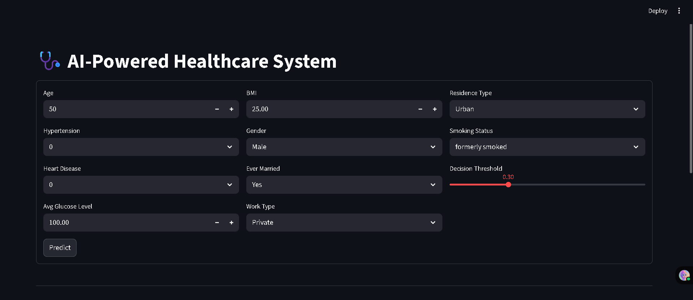
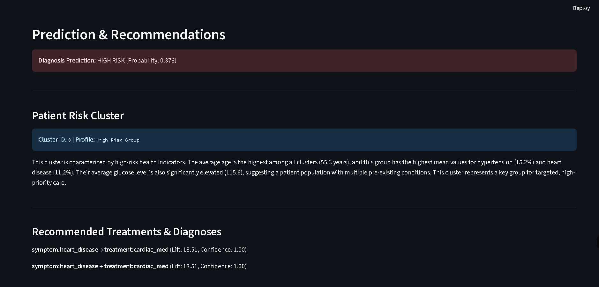

# 🩺 AI-Powered Healthcare System  

An end-to-end ML/AI project that predicts **stroke risk**, clusters patients into meaningful groups, and generates **treatment recommendations** using association rule mining. It also includes a **Streamlit app** for interactive predictions.  

---

## 📌 Features  
- **Data Preprocessing**  
  - Cleans and encodes the stroke dataset  
  - Handles missing values and categorical encoding  
  - Saves processed data  

- **Supervised Learning **  
  - Logistic Regression, Random Forest, XGBoost baselines  
  - 5-fold Cross Validation  
  - Evaluation with ROC AUC, Precision, Recall, F1  
  - SHAP-based feature importance  

- **Unsupervised Learning **  
  - KMeans & DBSCAN clustering  
  - Cluster profiles with mean feature summaries  
  - Risk-based cluster naming (High/Moderate/Low Risk groups)  

- **Association Rules**  
  - Simulated patient symptoms → treatments transactions  
  - Apriori + FP-Growth mining  
  - Top-10 rules exported for recommendations  

- **Streamlit App **  
  - Single patient risk prediction  
  - Cluster assignment with profile interpretation  
  - Recommended treatments from association rules  

---

## 🏗️ Project Structure  
```
ai-healthcare-system/
│
├── data/
│ ├── raw/ # Original dataset
│ ├── processed/ # Cleaned & preprocessed data
│ │ └── stroke_data_processed.csv
│
├── models/ # Trained & saved models
│ ├── model.pkl # Best supervised model (LogReg / RF / XGB)
│ ├── kmeans.pkl # Saved KMeans clustering model
│ ├── scaler.pkl # Scaler used for clustering
│
├── notebooks/ # Jupyter notebooks (experiments & reports)
│ ├── 01-eda.ipynb # Exploratory Data Analysis
│ ├── 02-supervised-baseline.ipynb# Baseline supervised models
│ ├── 03-clustering.ipynb # Clustering experiments
│ ├── 04-association.ipynb # Association rule mining
│
├── src/ # Source code
│ ├── data/
│ │ ├── load.py # Load raw/processed data
│ │ └── preprocess.py # Data cleaning & feature engineering
│ │
│ ├── models/
│ │ ├── baseline.py # Pipelines for baseline models
│ │ ├── trainer.py # Training & cross-validation
│ │ └── evaluate.py # Model evaluation & metrics
│ │
│ ├── unsupervised/
│ │ └── clustering.py # KMeans & DBSCAN + cluster profiling
│ │
│ ├── association/
│ │ └── apriori_rules.py # Association rules (Apriori/FP-Growth)
│ │
│ └── app/
│ └── streamlit_app.py # Streamlit web app integration
│
├── cluster_profiles.md # Cluster summaries (generated in Milestone 3)
├── association_rules.csv # Top-10 rules (generated in Milestone 4)
├── requirements.txt # Python dependencies
├── README.md # Project documentation
└── .gitignore # Files ignored by Git
```

## ⚙️ Installation & Setup  

1. Clone the repo:
   ```bash
   git clone https://github.com/yourusername/ai-healthcare-system.git
   cd ai-healthcare-system
2.Create a virtual environment:
  ```
  conda create -n ai-healthcare python=3.10 -y
  conda activate ai-healthcare
```
3.Install dependencies:
```
  pip install -r requirements.txt
```
## ⚡ Execution Workflow

Follow this order to execute the project end-to-end:

---


```bash
# Run data loading
python src/data/load.py

# Run preprocessing
python src/data/preprocess.py

# Train baseline models (LogReg, RF, XGBoost)
python src/models/trainer.py

# Evaluate saved model
python src/models/evaluate.py

# Run clustering (KMeans + DBSCAN)
python src/unsupervised/clustering.py

# Mine Apriori + FP-Growth rules
python src/association/apriori_rules.py

# Launch the interactive app
streamlit run src/app/streamlit_app.py
```
📈 Example Outputs
🧠 Model Performance

Logistic Regression (best CV ROC AUC ≈ 0.84)

XGBoost: tunable for higher recall/precision

🌀 Clustering

KMeans Silhouette Score ≈ 0.15

Clusters:

Cluster 0 → High-Risk Group

Cluster 1 → Moderate-Risk Group

Cluster 2 → Low-Risk Younger Group

📋 Example Rule
```
symptom:hypertension, symptom:obese → treatment:antihypertensive, treatment:lifestyle_change
(Lift: 18.51, Confidence: 1.00)
```
## 📸 Screenshots

### 🏠 Home Page


### 🧑‍⚕️ Single Patient Prediction


## 🛠️ Tech Stack

**Programming Language**
- Python 3.10+

**Libraries & Frameworks**
- **Data Handling**: `pandas`, `numpy`
- **Visualization**: `matplotlib`, `seaborn`
- **Machine Learning**: `scikit-learn`, `xgboost`, `imblearn`
- **Clustering**: `scikit-learn (KMeans, DBSCAN)`
- **Association Rules**: `mlxtend (Apriori, FP-Growth)`
- **Explainability**: `shap`
- **App Framework**: `streamlit`
- **Serialization**: `joblib`

  ## 🚀 Future Improvements

- **Deploy via Docker or Cloud**: Package the app using Docker or deploy on platforms like **Heroku**, **AWS**, or **GCP** for wider accessibility.  
- **Integrate Real Clinical Datasets**: Incorporate real-world patient datasets with treatment + outcome mappings to improve the reliability of predictions.  
- **Temporal Association Rules**: Enhance the association rule mining by including **temporal patient history** (sequence of symptoms → treatments → outcomes).  
- **Improved Interpretability**: Add interactive **LIME/SHAP dashboards** within the app for doctors and researchers to better understand model decisions.  


